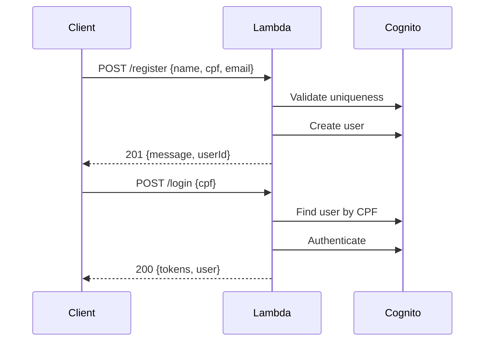
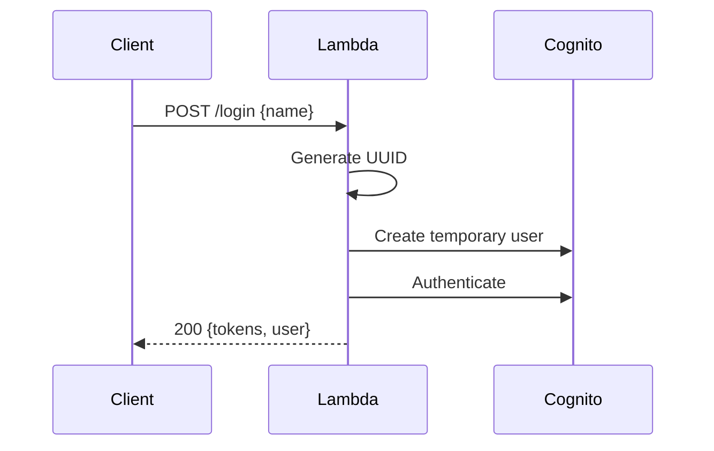

# Sistema de Autenticação Lambda - AWS Cognito

Este sistema implementa autenticação e registro de usuários usando AWS Lambda e AWS Cognito, suportando tanto usuários registrados quanto anônimos.

## 📋 Funcionalidades

-   ✅ **Registro de usuários** (`/register`)
-   ✅ **Login de usuários registrados** (`/login` com CPF)
-   ✅ **Login de usuários anônimos** (`/login` com nome)
-   ✅ **Validação de CPF** (algoritmo completo com dígitos verificadores)
-   ✅ **Validação de email** (formato RFC 5322)
-   ✅ **Verificação de unicidade** (CPF e email únicos)
-   ✅ **Tokens JWT nativos** do AWS Cognito
-   ✅ **Arquitetura em camadas** (Handler → Service → Repository)

## 🏗️ Arquitetura

```
src/
├── handlers/           # Camada de apresentação (API Gateway)
│   ├── registerHandler.ts
│   └── loginHandler.ts
├── services/          # Camada de lógica de negócio
│   └── userService.ts
├── repositories/      # Camada de acesso a dados (Cognito)
│   └── cognitoRepository.ts
├── validators/        # Validações de entrada
│   └── userValidator.ts
├── utils/            # Utilitários
│   └── responseUtils.ts
└── types/            # Definições TypeScript
    └── index.ts
```

## 🚀 Endpoints

### POST /register

Registra um novo usuário no sistema.

**Request Body:**

```json
{
    "name": "João da Silva",
    "cpf": "12345678901",
    "email": "joao@example.com"
}
```

**Response (201):**

```json
{
    "message": "User registered successfully",
    "userId": "12345678901"
}
```

### POST /login

Realiza login de usuário registrado ou anônimo.

#### Login - Usuário Registrado

**Request Body:**

```json
{
    "cpf": "12345678901"
}
```

#### Login - Usuário Anônimo

**Request Body:**

```json
{
    "name": "Usuario Anonimo"
}
```

**Response (200):**

```json
{
    "tokens": {
        "idToken": "eyJhbGciOiJIUzI1NiIsInR5cCI6IkpXVCJ9...",
        "accessToken": "eyJhbGciOiJIUzI1NiIsInR5cCI6IkpXVCJ9...",
        "refreshToken": "eyJhbGciOiJIUzI1NiIsInR5cCI6IkpXVCJ9..."
    },
    "user": {
        "id": "12345678901",
        "name": "João da Silva",
        "type": "authenticated"
    }
}
```

## 🔧 Configuração

### Variáveis de Ambiente

```bash
USER_POOL_ID=us-east-1_XXXXXXXXX    # ID do User Pool do Cognito
CLIENT_ID=XXXXXXXXXXXXXXXXXX        # ID do App Client do Cognito
USER_PASSWORD=TempPassword123!       # Senha padrão para usuários
```

### Atributos Customizados no Cognito

Configure os seguintes atributos no User Pool:

-   `custom:cpf` (String, mutable) - CPF do usuário
-   `custom:user_type` (String, mutable) - "authenticated" ou "anonymous"

## 📝 Validações

### CPF

-   ✅ Exatamente 11 dígitos
-   ✅ Não pode ter todos os dígitos iguais (111.111.111-11)
-   ✅ Validação de dígitos verificadores
-   ✅ Unicidade no sistema

### Email

-   ✅ Formato válido (RFC 5322)
-   ✅ Tamanho máximo: 254 caracteres
-   ✅ Unicidade no sistema

### Nome

-   ✅ Mínimo 2 caracteres
-   ✅ Máximo 100 caracteres
-   ✅ Não pode ser vazio

## 🔐 Segurança

-   **Sanitização de inputs** antes de processamento
-   **Logs seguros** (dados sensíveis mascarados)
-   **Validação rigorosa** de todos os parâmetros
-   **Tokens JWT nativos** do AWS Cognito
-   **Rate limiting** (configurar no API Gateway)

## 🧪 Testes

```bash
# Executar todos os testes
npm test

# Executar testes específicos
npm test userValidator
npm test userService

# Coverage
npm run test:coverage
```

## 📊 Códigos de Erro

| Código                  | Descrição                        | Status |
| ----------------------- | -------------------------------- | ------ |
| `INVALID_CPF`           | CPF inválido ou malformado       | 400    |
| `INVALID_EMAIL`         | Email inválido                   | 400    |
| `INVALID_NAME`          | Nome inválido                    | 400    |
| `DUPLICATE_CPF`         | CPF já cadastrado                | 409    |
| `DUPLICATE_EMAIL`       | Email já cadastrado              | 409    |
| `USER_NOT_FOUND`        | Usuário não encontrado           | 404    |
| `AUTHENTICATION_FAILED` | Falha na autenticação            | 401    |
| `MISSING_PARAMETERS`    | Parâmetros obrigatórios ausentes | 400    |
| `METHOD_NOT_ALLOWED`    | Método HTTP não permitido        | 405    |
| `ROUTE_NOT_FOUND`       | Rota não encontrada              | 404    |
| `CONFIG_ERROR`          | Erro de configuração do servidor | 500    |
| `INTERNAL_ERROR`        | Erro interno do servidor         | 500    |

## 🔄 Fluxos de Uso

### 1. Usuário Registrado



### 2. Usuário Anônimo



## 🔧 Deployment

### SAM Template (template.yaml)

```yaml
Resources:
    AuthFunction:
        Type: AWS::Serverless::Function
        Properties:
            Environment:
                Variables:
                    USER_POOL_ID: !Ref CognitoUserPool
                    CLIENT_ID: !Ref CognitoUserPoolClient
                    USER_PASSWORD: 'TempPassword123!'
            Events:
                RegisterApi:
                    Type: Api
                    Properties:
                        Path: /register
                        Method: post
                LoginApi:
                    Type: Api
                    Properties:
                        Path: /login
                        Method: post
```

### Deploy

```bash
sam build
sam deploy --guided
```

## 🏃‍♂️ Desenvolvimento Local

```bash
# Instalar dependências
npm install

# Executar testes
npm test

# Build TypeScript
npm run compile

# Lint
npm run lint
```

## 📈 Monitoramento

-   **CloudWatch Logs**: Logs estruturados com níveis apropriados
-   **CloudWatch Metrics**: Métricas customizadas para registros/logins
-   **X-Ray**: Tracing distribuído (opcional)

## 🔮 Melhorias Futuras

-   [ ] **Cache Redis** para validações de unicidade
-   [ ] **Lambda agendado** para limpeza de usuários anônimos antigos
-   [ ] **Rate limiting** avançado por IP/usuário
-   [ ] **Métricas customizadas** no CloudWatch
-   [ ] **Logs estruturados** em JSON
-   [ ] **Validação de CPF avançada** (blacklist de CPFs conhecidos)
-   [ ] **Suporte a refresh tokens** automático
-   [ ] **Webhook notifications** para eventos de usuário

## 📄 Licença

MIT License - veja o arquivo LICENSE para detalhes.
